# 主要フロー シーケンス図

## 1. 概要

Mini-SNSの主要ユースケースにおける晴天シナリオと雨天シナリオのシーケンス図を示します。

## 2. ユーザー登録フロー

### 2.1 晴天シナリオ（正常系）

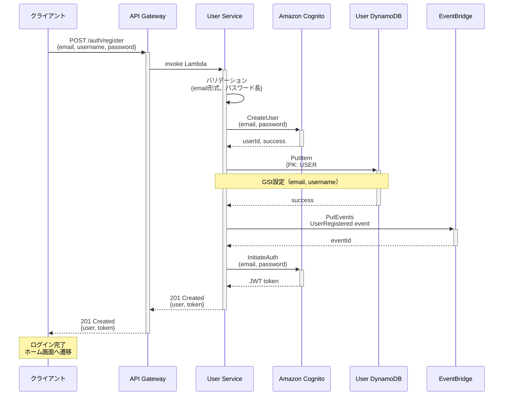

**所要時間**: p95 ≤ 1.5秒

### 2.2 雨天シナリオ（重複メールアドレス）

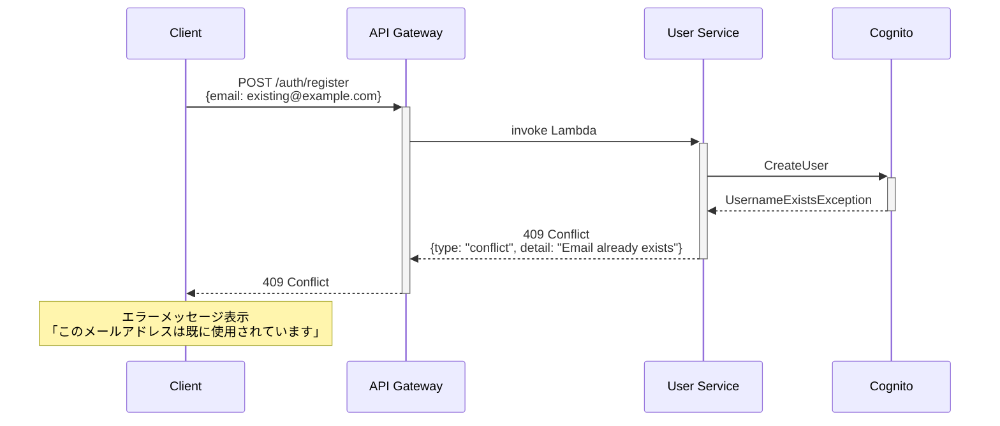

**エラー処理**: リトライ不要（クライアント側で別メールアドレス入力）

## 3. 投稿作成→タイムライン配信フロー

### 3.1 晴天シナリオ（正常系）

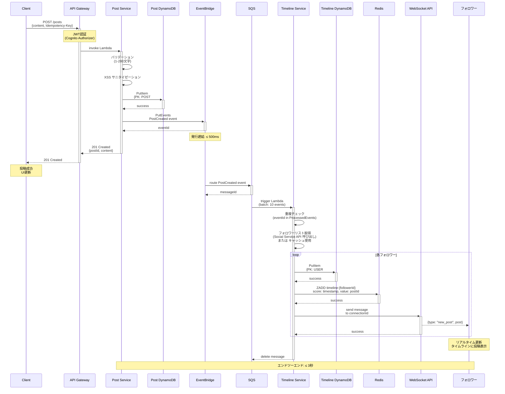

**SLA**:
- 投稿作成API応答: p95 ≤ 500ms
- PostCreatedイベント発行遅延: ≤ 500ms
- タイムライン配信遅延（WebSocket）: ≤ 3秒（エンドツーエンド）

### 3.2 雨天シナリオ（Timeline Service 処理失敗）

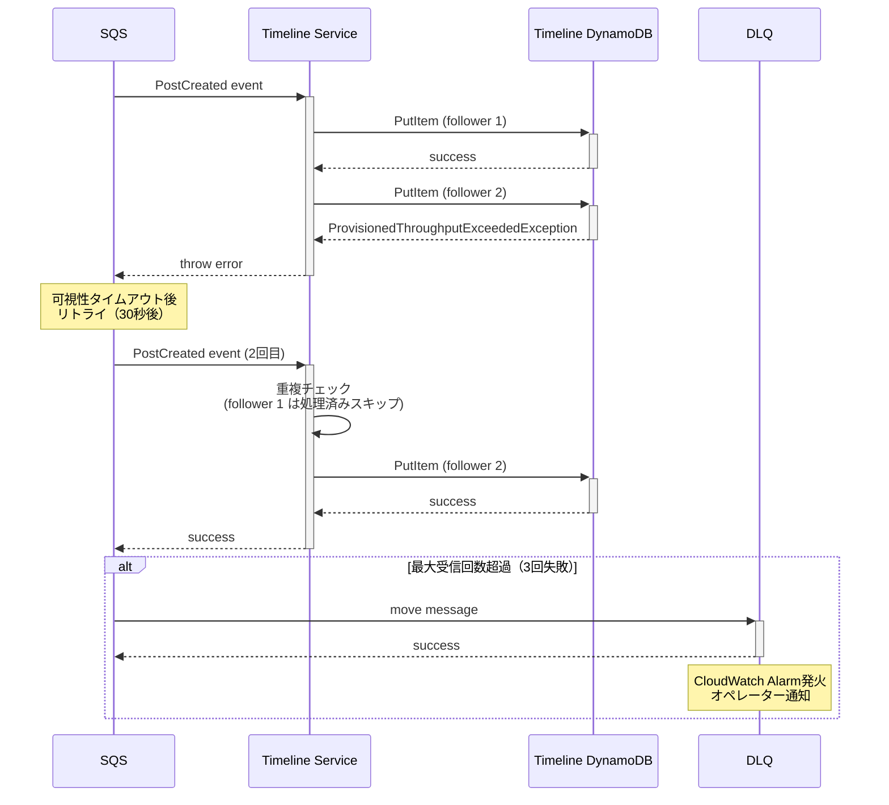

**リトライ戦略**:
- 最大受信回数: 2回
- 可視性タイムアウト: 30秒
- DLQ移動後: 手動リカバリー（Runbook参照）

## 4. タイムライン取得フロー

### 4.1 晴天シナリオ（キャッシュヒット）

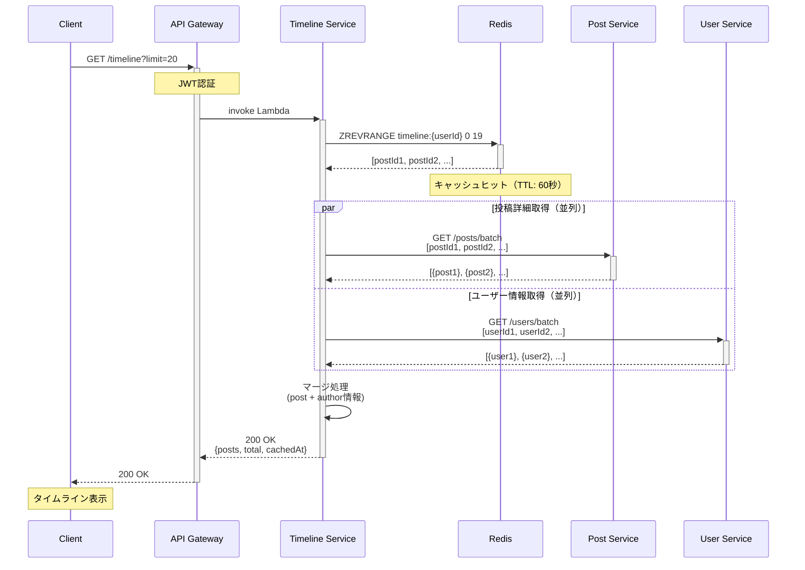

**所要時間**: p95 ≤ 250ms（キャッシュヒット時）

### 4.2 雨天シナリオ（キャッシュミス + Post Service タイムアウト）

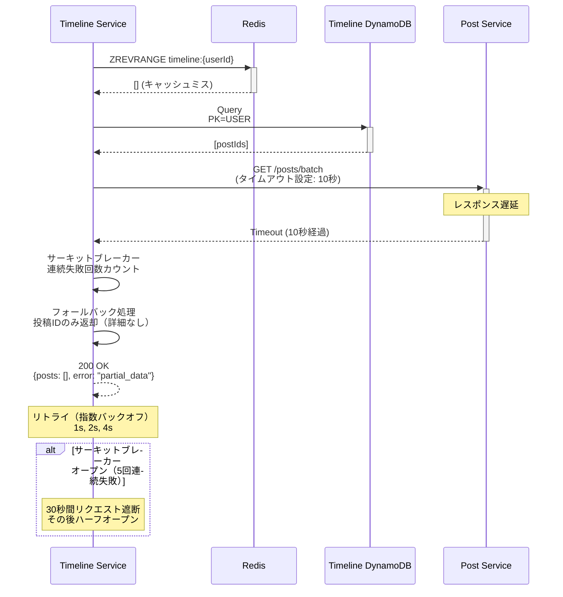

**エラーハンドリング**:
- タイムアウト: 10秒
- リトライ: 3回（指数バックオフ）
- サーキットブレーカー: 5回失敗で30秒オープン

## 5. フォロー作成→タイムライン更新フロー

### 5.1 晴天シナリオ（正常系）

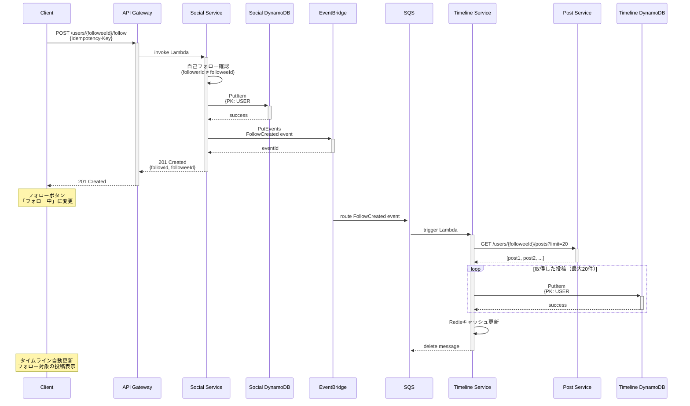

**所要時間**: フォローAPI応答 ≤ 1秒、タイムライン更新 ≤ 5秒

### 5.2 雨天シナリオ（重複フォロー）

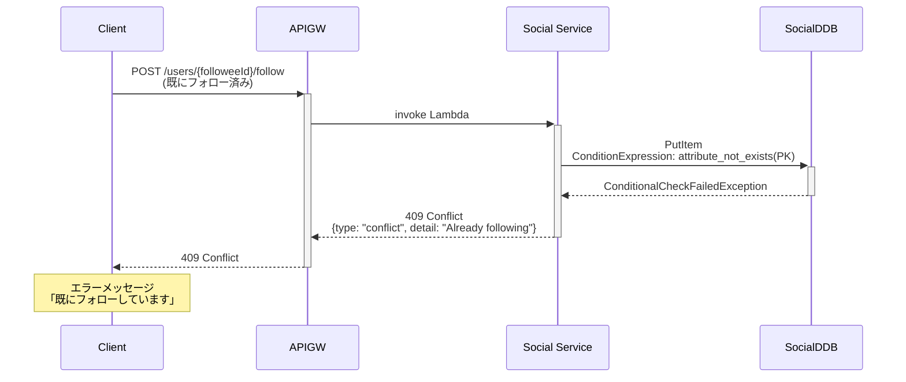

**冪等性**: Idempotency-Keyチェック + 条件付き書き込みで重複防止

## 6. エラーシナリオ共通パターン

### 6.1 認証エラー（401 Unauthorized）

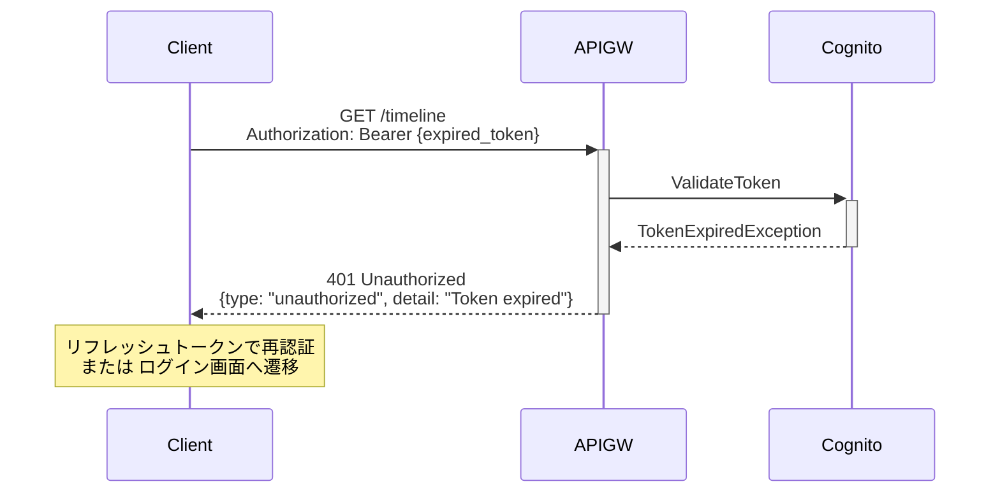

### 6.2 レート制限エラー（429 Too Many Requests）

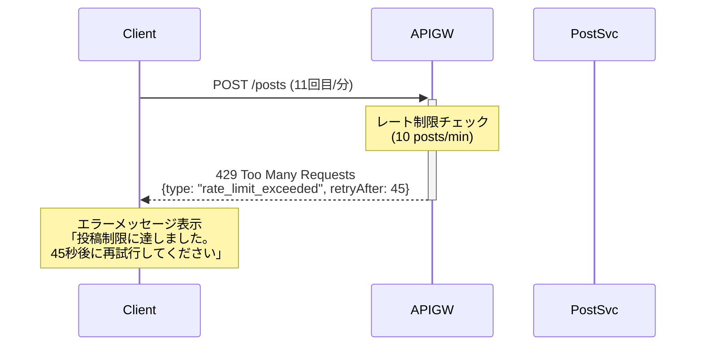

### 6.3 データベースエラー（500 Internal Server Error）

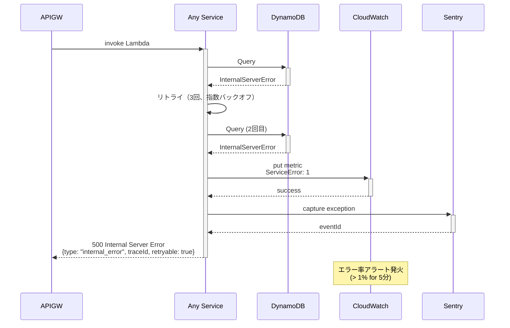

## 7. パフォーマンス最適化フロー

### 7.1 バッチAPI活用（N+1問題回避）

**Before**（N+1問題）:
```
Timeline Service → Post Service: GET /posts/postId1 (100ms)
Timeline Service → Post Service: GET /posts/postId2 (100ms)
...
Timeline Service → Post Service: GET /posts/postId20 (100ms)
合計: 20 × 100ms = 2,000ms
```

**After**（バッチAPI）:
```
Timeline Service → Post Service: POST /posts/batch [postId1, ..., postId20] (200ms)
合計: 200ms
```

**改善率**: 90% レイテンシ削減

### 7.2 Redis キャッシュ活用

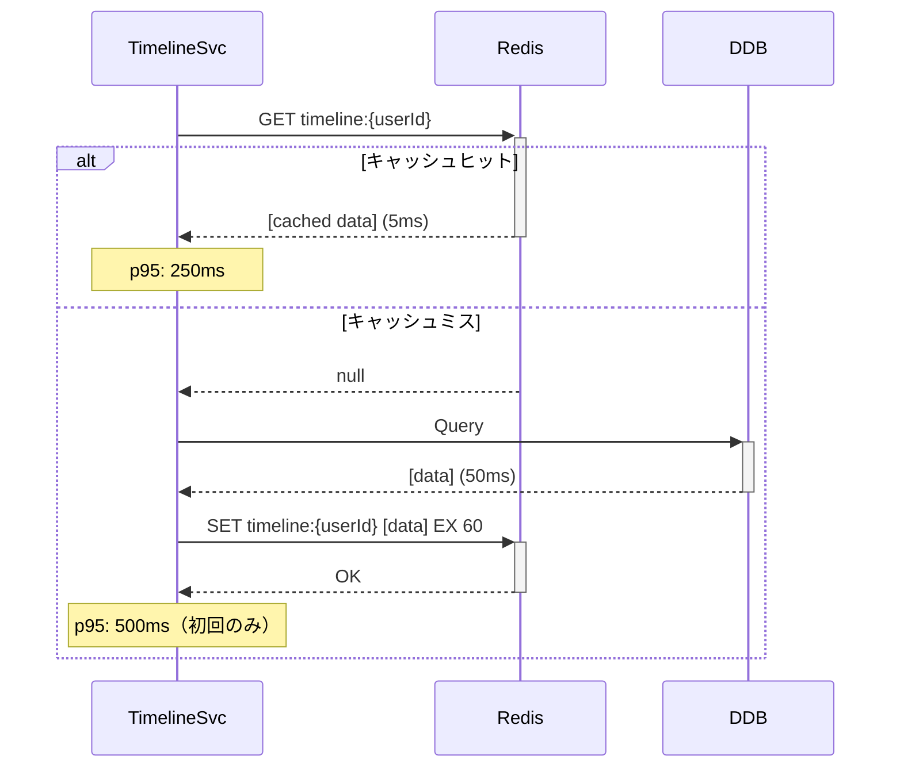

**キャッシュヒット率目標**: ≥ 80%

## 8. 参考資料

- [マイクロサービスパターン - サーキットブレーカー](https://microservices.io/patterns/reliability/circuit-breaker.html)
- [AWS Well-Architected Framework - Reliability Pillar](https://docs.aws.amazon.com/wellarchitected/latest/reliability-pillar/welcome.html)
